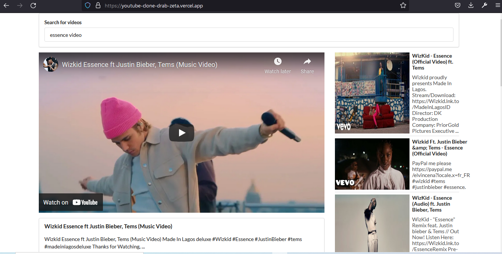

The project can be viewed at: https://youtube-clone-drab-zeta.vercel.app/.

This project is the clone of the popular video hosting website known as Youtube. It uses the Youtube API to fetch the displayed videos. The User-Interface(UI) is built using Semantic UI and the whole app is bootstrapped with create-react-app.
